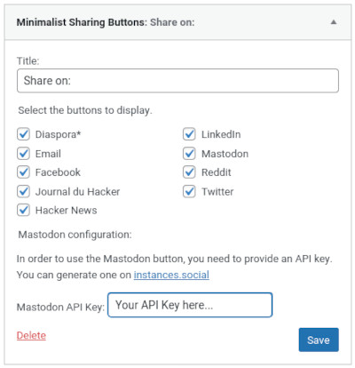
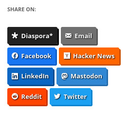
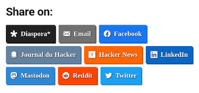

# Minimalist Sharing Buttons

 

A WordPress widget to display share buttons.

## Introduction

I could have name this plugin _Yet another share plugin_ since there are many plugins to add social buttons on WordPress.

However, this one is very simple. No extra features, no customization, no counter, nothing apart links. You simply choose the social networks you want to display **as a widget** and the plugin will display links to share your page. The order is alphabetical.

The available websites are:

-   Diaspora\*
-   Email
-   Facebook
-   Hacker news
-   Le journal du hacker
-   LinkedIn
-   Mastodon
-   Reddit
-   Twitter

## Install

### Composer installation

You can use Composer to install this plugin as a dependency if you use `wordpress-plugin` installers:

```
{
"require": {
    "armandphilippot/minimalist-sharing-buttons": "dev-master"
}
"repositories": [{
    "type": "git",
    "url": "git@github.com:ArmandPhilippot/minimalist-sharing-buttons.git"
}]
```

### Manual installation

You can download this plugin on Github, then extract it in `/wp-content/plugins/` directory.

## Usage

1. Navigate to the "_Plugins_" dashboard page and click on "_Activate_".
2. Add "_**Minimalist Sharing Buttons**_" to a widget area through the "_Widgets_" menu in WordPress.
3. Choose the buttons you want to display.
4. (optional) If you want to display the Mastodon button, you need to provide an API token. You can generate one on [instances.social](https://instances.social/api/token).

Minimalist Sharing Buttons uses [Mastodon Sharing Button](https://github.com/ArmandPhilippot/mastodon-sharing-button) to provide a Mastodon button. By setting an API token, it will be share with the other project (locally, nothing goes elsewhere) to generate a valid list of instances. This instances list is used to validate the user input and to provide suggestions to the user.

## Screenshots



Examples:

| Twenty twelve Theme                                                         | Twenty nineteen Theme                                                         |
| --------------------------------------------------------------------------- | ----------------------------------------------------------------------------- |
|  |  |

## Disclaimer

I wanted to keep this project minimalist. So there is no extra features. The buttons take the order defined in `admin/json/social-networks.json` which is alphabetical. It is not possible to reorder them without editing this file.

You may need to declare some styles to integrate the plugin in your theme. For example, the _Twenty Twenty_ theme add some margins so the first button is misaligned. I didn't want to overload the widget with unnecessary styles for most themes.

I use `!important` on links `color`. Without it, some themes overwrite the color with complex selectors. By doing this, the plugin is usable on a large selection of themes but I haven't test everywhere.

The widget uses Javascript to open a popup when the user click on a button. But, it works also with scripts disabled. It's a simple link.

## Licenses

This project is open source and available under the [GPL v2 or later License](https://github.com/ArmandPhilippot/minimalist-sharing-buttons-widget/blob/master/LICENSE).

This project uses [Mastodon Sharing Button](https://github.com/ArmandPhilippot/mastodon-sharing-button) which is licensed under the MIT license.
